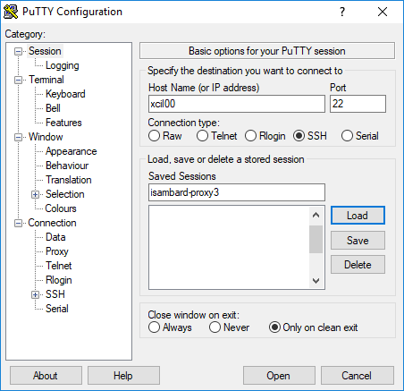
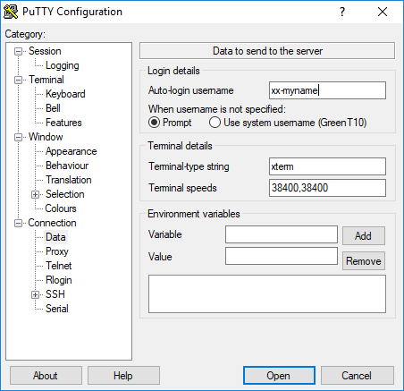
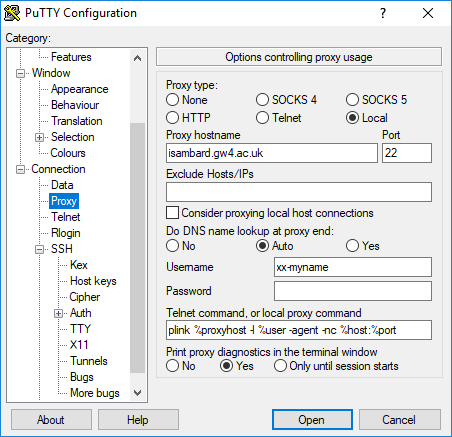

Connecting to Isambard
----------------------
.. note::
  You will need an SSH key-pair to access Isambard. 

Linux
.....

The following stanza is required in your local ``~/.ssh/config`` in order to traverse the bastion hosts transparently and enable SCP usage:

.. code-block:: text

 # --- GW4 Isambard --- #
 Host *isambard.gw4.ac.uk *isambard
   User XX-USERNAME
   ForwardAgent yes
   ForwardX11 yes
   ServerAliveInterval 60
   IdentityFile ~/.ssh/id_rsa

 # Isambard: MACS
 Host login-01.isambard.gw4.ac.uk login-01.isambard login.isambard
   Hostname login-01
   ProxyCommand ssh isambard.gw4.ac.uk 'nc %h %p'

 Host login-02.isambard.gw4.ac.uk login-02.isambard
   Hostname login-02
   ProxyCommand ssh isambard.gw4.ac.uk 'nc %h %p'

 # Isambard: XCI
 Host xcil00.isambard.gw4.ac.uk xcil00.isambard xci.isambard
   Hostname xcil00
   ProxyCommand ssh isambard.gw4.ac.uk 'nc %h %p'

 Host xcil01.isambard.gw4.ac.uk xcil01.isambard
   Hostname xcil01
   ProxyCommand ssh isambard.gw4.ac.uk 'nc %h %p'

 # Isambard: A64FX
 Host gw4a64fxlogin00.isambard.gw4.ac.uk a64fxlogin00.isambard a64fx.isambard
   Hostname gw4a64fxlogin00
   ProxyCommand ssh isambard.gw4.ac.uk 'nc %h %p'

 Host gw4a64fxlogin01.isambard.gw4.ac.uk a64fxlogin01.isambard
   Hostname gw4a64fxlogin01
   ProxyCommand ssh isambard.gw4.ac.uk 'nc %h %p'

# Isambard: Phase-3
 Host p3login01.isambard.gw4.ac.uk p3login01.isambard p3login.isambard
   Hostname p3login01
   ProxyCommand ssh isambard.gw4.ac.uk 'nc %h %p'

.. caution::
  Update the ``~/.ssh/config`` with your details:-

  - Substitute ``XX-USERNAME`` with your Isambard username 
  - The ``IdentityFile`` points to the SSH key (private) that will be used for connecting to Isambard, the default for most users will be ``~/.ssh/id_rsa``. If you are using a different key Eg. ``~/keystore/isambard``, the entry should be ``IdentityFile ~/keystore/isambard``
  - We recommend you overwrite previous versions of this configuration when updating in to ensure your configuration matches the documentation

To test the connection please first try connecting to the MACS system.  This will ensure any initial configuration is performed for the first-time user.

MACS - Multi-Architecture Comparison System
###########################################

| To access the MACS, run either ``ssh login-XX.isambard`` or ``ssh login.isambard``

XCI - Marvell Thunder X2
########################

| To access the XCI XC50 Arm system, run either ``ssh xcil00.isambard`` or ``ssh xci.isambard``

A64FX - Fujitsu A64FX
#####################

| To access the Fujitsu A64FX Arm system, run either ``ssh a64fxlogin00.isambard`` or ``ssh a64fx.isambard``

Phase-3 - GPUs and Milan
#####################

| To access the Phase-3 system, run either ``ssh p3login01.isambard`` or ``ssh p3login.isambard``

Remember to replace ``XX-USERNAME`` with your Isambard username.

Windows
.......

SSH keys can be created with Puttygen and managed with Putty's Pageant to make them available to Putty and WinSCP.  Especially useful if you use a passphrase to protect your SSH private key.

WinSCP
^^^^^^

If you are using windows then the simplest way to set up access to Isambard is to with WinSCP:

1. First create a New Site

   - Enter Hostname and your Username
   - Note that for Phase 2 (xcil00/01) the names are 'ex', 'see', 'eye', 'el', 'zero', 'zero'/'one'.
   - For Phase 1 replace this with login-01/02 as per the ssh config above.

.. image:: ../images/winscp_session.jpg

2. Next click on Advanced and Connection -> Tunnel.

   - Select to 'Connect through SSH tunnel'
   - Enter the proxy hostname 'isambard.gw4.ac.uk' and your username.

.. image:: ../images/winscp_tunnel.jpg

3. Click OK and Save, then Login and Enjoy ...

Putty
^^^^^

Putty provides a shell to a remote server.  As in the instructions for Linux a proxy command will be used to access the login node of the system you want.

1. Set hostname to the the login node of the Isambard system, such as xcil00

2. Next click on Connection -> Data and add your username to 'Auto-login username' e.g. xx-myname

3. Next click on Connection -> Proxy

   - Select 'Local' for 'Proxy type'
   - Enter 'isambard.gw4.ac.uk' for 'Proxy hostname'
   - Enter your username for 'Username'
   - Enter 'plink %proxyhost -l %user -agent -nc %host:%port' for 'Telnet command, or local proxy command'

4. Click back to Session and save your connection settings and connect.  If using ssh keys you should not need to use a password.

