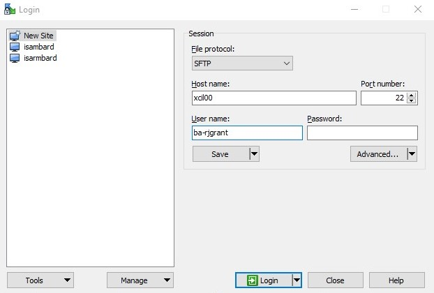
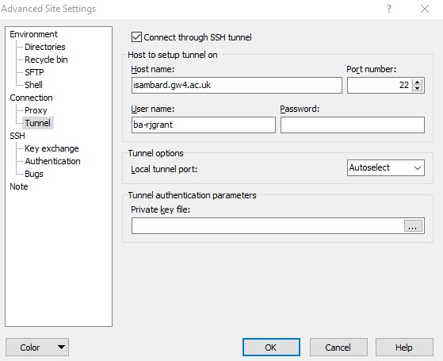

Connecting to Isambard
----------------------

Linux
.....

The following stanza is required in your local ``~/.ssh/config`` in order to traverse the bastion hosts transparently and enable SCP usage:

.. code-block:: text

  Host *isambard.gw4.ac.uk *isambard
    User XX-USERNAME
    ForwardAgent yes
    ForwardX11 yes
  
  Host login-01.isambard.gw4.ac.uk login-01.isambard login.isambard
    Hostname login-01
    User XX-USERNAME
    ProxyCommand ssh isambard.gw4.ac.uk 'nc %h %p'
  
  Host login-02.isambard.gw4.ac.uk login-02.isambard
    Hostname login-02
    User XX-USERNAME
    ProxyCommand ssh isambard.gw4.ac.uk 'nc %h %p'
  
  Host xcil00.isambard.gw4.ac.uk xcil00.isambard xci.isambard
    Hostname xcil00
    User XX-USERNAME
    ProxyCommand ssh isambard.gw4.ac.uk 'nc %h %p'
  
  Host xcil01.isambard.gw4.ac.uk xcil01.isambard
    Hostname xcil01
    User XX-USERNAME
    ProxyCommand ssh isambard.gw4.ac.uk 'nc %h %p'

To access the Isambard Phase 1 mixed-arch system, run either ``ssh login-XX.isambard`` or ``ssh login.isambard``

To access the Isambard Phase 2 XC50 ARM system, run either ``ssh xcil00.isambard`` or ``ssh xci.isambard``

Remember to replace ``XX-USERNAME`` with your Isambard username.

Windows
.......

If you are using windows then the simplest way to set up access to Isambard is to with WinSCP:

1. First create a New Site

   - Enter Hostname and your Username
   - Note that for Phase 2 (xcil00/01) the names are 'ex', 'see', 'eye', 'el', 'zero', 'zero'/'one'.
   - For Phase 1 replace this with login-01/02 as per the ssh config above.

2. Next click on Advanced and Connection -> Tunnel.

   - Select to 'Connect through SSH tunnel'
   - Enter the proxy hostname 'isambard.gw4.ac.uk' and your username.

3. Click OK and Save, then Login and Enjoy ...
